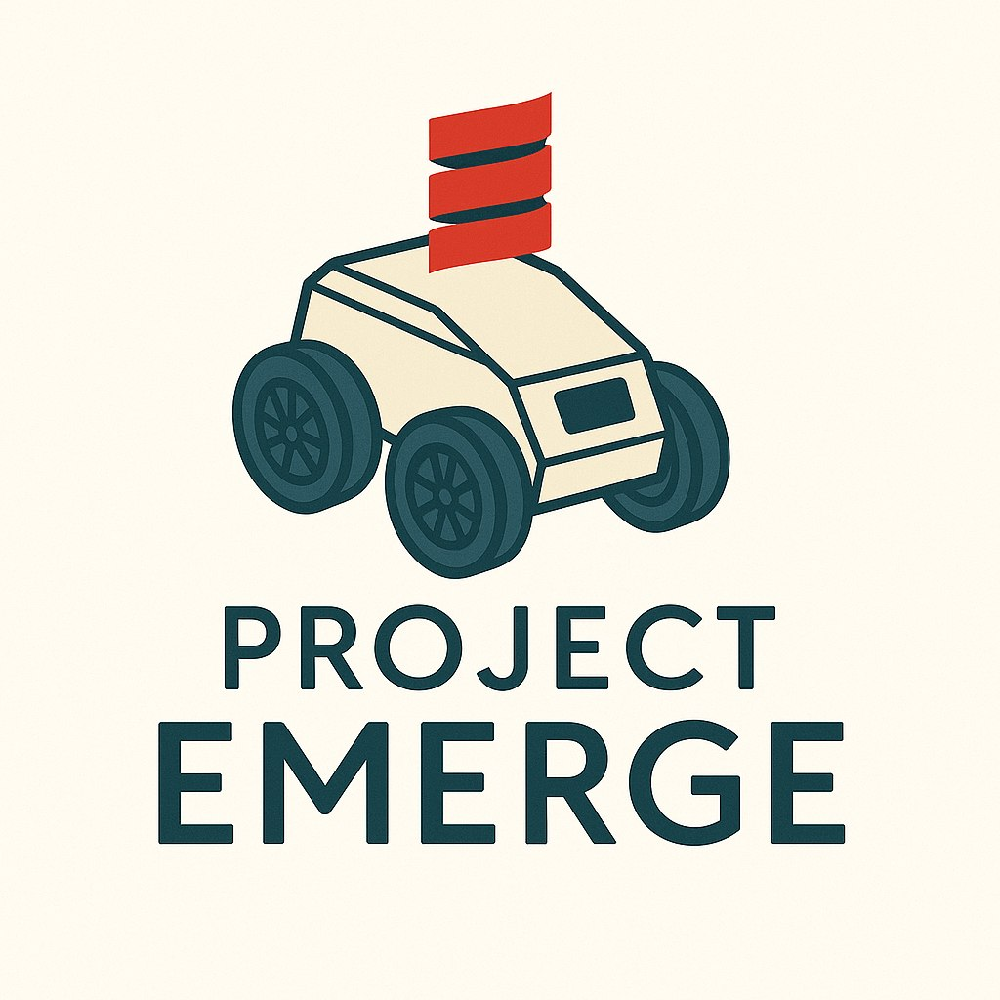
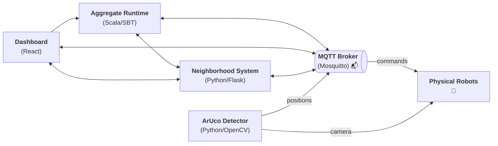

<p align="center">
  
</p>

# Project Emerge

[](https://github.com//Project-Emerge/Project-Emerge-system/actions/workflows/dispatcher.yml) [](https://github.com/semantic-release/semantic-release)     [](https://ktlint.github.io/)


     

## Description

**Project Emerge** is a modular, open-source toolchain for practical multi-robot demonstrations based on aggregate computing principles.

The swarm of robots is coordinated using an _[Aggregate Programming](https://ieeexplore.ieee.org/document/7274429)_ based framework: *[ScaFi](https://github.com/scafi/scafi)*, allowing for robust, scalable, and adaptive collective behaviors. This approach allows individual robots in a swarm to cooperate and coordinate tasks efficiently by focusing on high-level goals rather than low-level instructions. The system achieves this through decentralized algorithms, where each robot processes local information and communicates with its neighbors, resulting in robust and scalable collective behaviors suitable for dynamic and unpredictable environments.

It features a real-time dashboard that visualizes and controls a swarm of robots, a Python backend for neighborhood logic, MQTT-based communication, and an ArUco marker detector for real-time robot localization.  
The system is designed for research, demonstrations, and educational robotics.

Since hardware is not always available or convenient to use, an emulator ([robot-emulation](https://github.com/Project-Emerge/robot-emulation)) has been implemented that can replace the ArUco Detector component for physical robots. This allows users to emulate robot behavior and test the system without requiring access to real hardware.

## Project Structure




```
Project-Emerge-system/
├── aggregate-runtime/               # Aggregate programming runtime (Scala/SBT)
│   ├── Dockerfile                   # Containerization for aggregate runtime
│   └── src/main/scala/it/unibo/
│       ├── core/                    # Core aggregate programming logic
│       ├── demo/                    # Example/demo aggregate programs
│       ├── mqtt/                    # MQTT integration for aggregate runtime
│       └── utils/                   # Utility functions and helpers
│
├── aruco-detector/                  # ArUco marker detection for robot localization (Python/OpenCV)
│   ├── Dockerfile                   # Containerization for detector
│   ├── estimator.py                 # Estimation logic for marker positions
│   ├── main.py                      # Main entrypoint for detection
│   └── models/
│       └── edsr_x2.pb               # Pretrained model for super-resolution
│
├── dashboard/                       # React dashboard (UI, controls, visualization)
│   ├── Dockerfile                   # Containerization for dashboard
│   ├── index.html                   # Main HTML entrypoint
│   ├── public/                      # Static assets (models, icons, etc.)
│   └── src/
│       ├── assets/                  # 3D models and images
│       ├── components/              # UI components (TopBar, ControlPanel, etc.)
│       ├── mqtt/                    # MQTT connection and hooks for dashboard
│       └── types/                   # TypeScript type definitions
│
├── mqtt/                            # MQTT broker configuration (Mosquitto)
│   └── config/
│       └── mosquitto.conf           # Mosquitto broker configuration file
│
└── neighborhood-system/             # Python backend (Flask, MQTT, ArUco detector)
    ├── Dockerfile                   # Containerization for backend
    └── main.py                      # Flask app and MQTT logic
```

##### Subpackage Descriptions:

- **aggregate-runtime/**  
  Implements the aggregate programming logic (ScaFi), including core algorithms, MQTT integration, and demo programs for distributed coordination.

- **aruco-detector/**  
  Provides ArUco marker detection and position estimation using OpenCV, enabling real-time localization of robots via camera input.

- **dashboard/**  
  The web-based user interface for visualization and control, built with React. Includes components for robot control, formation selection, and real-time feedback.

- **mqtt/**  
  Contains configuration for the Mosquitto MQTT broker, which enables real-time messaging between all system components.

- **neighborhood-system/**  
  The Python backend that manages robot state, neighborhood logic, and acts as a bridge between the dashboard, aggregate runtime, and localization modules.

---
## Credits

**Contributors:**  
<a href="https://github.com/Project-Emerge/Project-Emerge-system/graphs/contributors">
	
</a>

---

Feel free to [contribute](https://github.com/Project-Emerge/Project-Emerge-system/pulls), open [issues](https://github.com/Project-Emerge/Project-Emerge-system/issues), or suggest improvements!